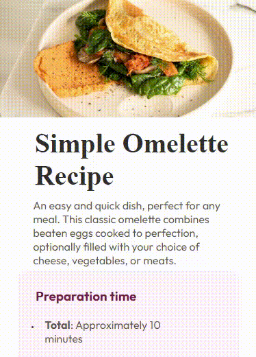

# Frontend Mentor - Recipe Page Solution

Essa é a solução para o [Recipe Page Challenge no Frontend Mentor](https://www.frontendmentor.io/challenges/recipe-page-KiTsR8QQKm).

## Índice

- [Visão Geral](#visão-geral)
  - [O Desafio](#o-desafio)
  - [Captura de Tela](#captura-de-tela)
  - [Links](#links)
- [Meu Processo](#meu-processo)
  - [Ferramentas Utilizadas](#ferramentas-utilizadas)
  - [O Que Aprendi](#o-que-aprendi)
  - [Desenvolvimento Contínuo](#desenvolvimento-contínuo)
  - [Recursos Úteis](#recursos-úteis)
- [Autor](#autor)
- [Agradecimentos](#agradecimentos)

## Visão Geral

Após alguns meses sem programar, estou retomando a prática com este projeto, escolhido para refrescar e aprimorar meus conhecimentos.

### Captura de Tela

- Web: 
- Mobile: 

### Links

- Link para visitação: [Recipe Page Live](https://eletrocp.github.io/Recipe-page/)

## Meu Processo

Inicialmente, escrevi testes para garantir um padrão no desenvolvimento. Em seguida, organizei a estrutura do HTML com as tags necessárias. Por fim, estilizei o projeto utilizando CSS, seguindo o modelo "mobile first", definindo classes e divisões conforme necessário.

### Ferramentas Utilizadas

- HTML5 semântico
- Propriedades personalizadas no CSS
- Flexbox
- Design "mobile first"
- Cypress para testes automatizados
- Eslint para padronização de código
- Stylelint para padronização de estilo

### O Que Aprendi

Depois de um tempo sem programar, percebi que alguns conceitos que antes pareciam difíceis agora são mais compreensíveis. Sempre tive dificuldades com CSS, e este projeto me mostrou que é possível dominar a linguagem com prática. Consegui desenvolver o básico com certa facilidade e aprendi mais sobre posicionamento e layout.

### Desenvolvimento Contínuo

Agora que tenho uma melhor compreensão de CSS, pretendo me aprofundar nas técnicas de estilização para melhorar continuamente minhas habilidades. Também quero expandir meu conhecimento na estruturação do HTML, assegurando que as tags, classes e IDs adequadas sejam definidas desde o início.

### Recursos Úteis

- [Cypress](https://www.cypress.io/) - Uma ferramenta prática e rápida para testes frontend.
- [W3Schools](https://www.w3schools.com/css/) - Um ótimo recurso de consulta para diversas linguagens, incluindo CSS.

## Autor

- Website - [Breno Lopes](https://eletrocp.github.io/Portifolio/)
- Frontend Mentor - [@EletroCP](https://www.frontendmentor.io/profile/Eletrocp)
- Linkedin - [@EletroCP](https://www.linkedin.com/in/eletrocp/)

## Agradecimentos

Gostaria de agradecer à [Yuut](https://www.linkedin.com/in/ingride-reis-yuut/) por sempre me apoiar e motivar a continuar.